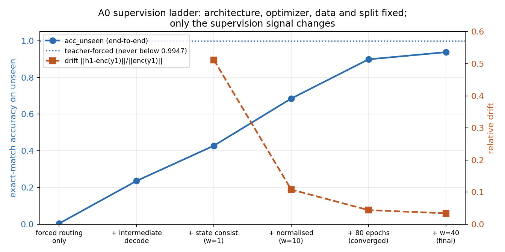
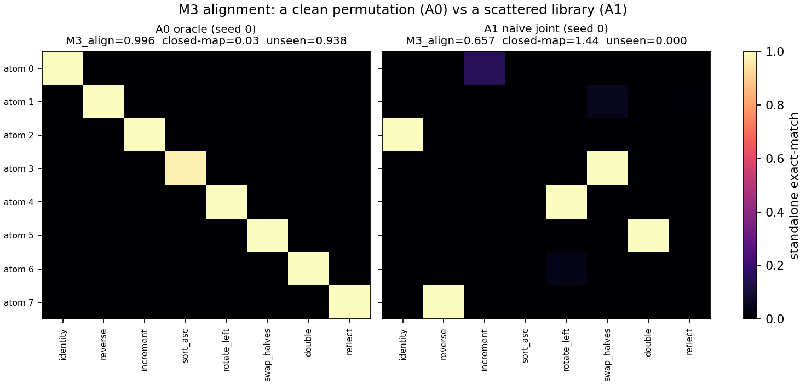
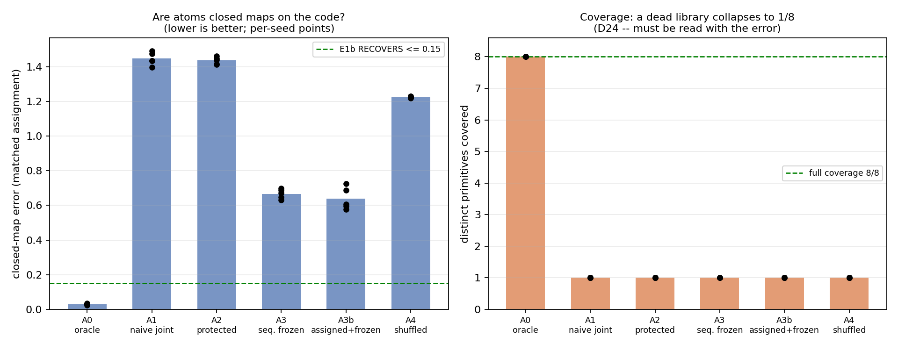
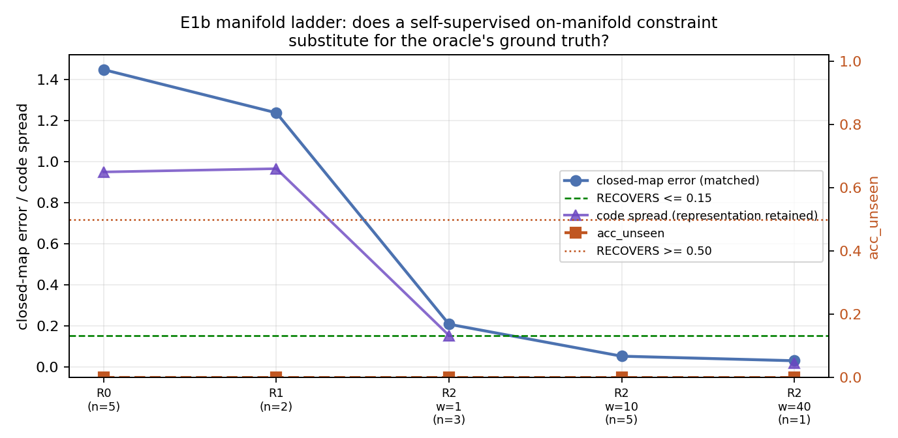

# E1 / E1b — Atom Factorization Battery: report

**Status.** E1 complete: 30 runs, 6 arms × 5 seeds. **E1b is RETRACTED and being
re-run** — external review found three implementation defects affecting it (D32);
§6 and E1b's half of §7 should not be cited until re-established.

**Gates:** T2, T4–T8 passed as specified. **T1 did not pass as written** — its
threshold was amended mid-experiment (§9) and the amended form is not equivalent to
the original. Earlier drafts of this report said "all gates passed"; that was
misleading and is corrected here.

Every number here is regenerated by `python -m e1.aggregate` from saved artifacts.
Deviations, with reasons, are in [`e1/DECISIONS.md`](../../e1/DECISIONS.md) (D1–D32).

> **Archived (D41).** This is the record of the **v1 battery as run on `Perro`**
> (Intel). It is complete and citable as such, and is not regenerated by later work:
> D39 forbids comparing it against runs made on `Perrito` (AMD), and D40's v2
> generation measures a different task family. Reproduce it with
> `python -m e1.aggregate --generation v1 --runs runs/archive_perro_v1`.

---

## 1. Question and design

**The question.** A capability library is only useful if its atoms are *independently
meaningful primitives* rather than co-adapted fragments. If atom A and atom B each
hold half the information for task AB, training loss falls and nothing generalises —
gradient descent actively seeks this. E1 tests whether atoms factorize (hypothesis
H6). It is a hard gate: if they do not, the marginal-cost curve (H1) and the
atom-space geometry (H3) are both uninterpretable.

**The task family.** Integer sequences, length 8, digits 0–9. Eight unary primitives:
`identity`, `reverse`, `increment` (+1 mod 10), `sort_asc`, `rotate_left`,
`swap_halves`, `double` (×2 mod 10), `reflect` (9−x). Tasks are ordered pairs applied
left-to-right, plus all eight singletons. Synthetic and fully specified, so a
perfectly factorized solution is guaranteed to exist in principle — if the model
cannot find it, that is a fact about training, not about the task.

**The split.** 64 ordered pairs → 40 train / 24 held-out. Evaluation compares
`seen_heldout` (fresh examples of *training* compositions) against `unseen`
(held-out compositions). Comparing against training examples would confound
memorisation with composition.

**The architecture.** Function-space atoms — invoked subnetworks composed by routing
and sequencing, never summed weight deltas.

```
tokens → Encoder → h₀
for t in 1..2:
    q_t = Composer(h_{t-1}, instruction_t)     # small, independent of N
    w_t = softmax(q_t · K_atoms / √d_k)         # content-based routing; keys in atoms
    a_t = Gumbel top-1(w_t)                     # discrete
    h_t = h_{t-1} + Atom_{a_t}(h_{t-1})         # residual application
h_2 → Decoder → logits
```

8 atoms (MLP 512→256→512, 262,912 params each), composer 29,376 params, encoder
51,136, decoder 50,762. Composer is **1.4%** of the library and provably independent
of atom count (asserted at N = 4, 8, 16).

**The arms.** Identical architecture, data, split, optimizer and epoch budget;
they differ *only* in training procedure.

| arm | procedure | role |
|---|---|---|
| **A0** | routing forced to ground truth + intermediate-state supervision | **oracle / ceiling** |
| **A1** | joint training, fixed co-occurrence order, no countermeasures | baseline pathology |
| **A2** | A1 + atom dropout 0.15 + randomised co-occurrence | do cheap countermeasures suffice? |
| **A3** | curriculum: singletons first, then pairs with library frozen | structural anti-co-adaptation |
| **A3b** | A3 with phase-1 atom↔primitive assignment forced (diagnostic, added — D23) | isolates assignment from freezing |
| **A4** | A2 with permuted training targets | leakage control (gate T3) |

**Why the oracle exists.** A single-arm negative result is unusable. Without a
demonstration that *some* configuration of this architecture solves the task, every
other arm's failure is ambiguous between "training is wrong" and "the architecture
cannot express the solution." A0 removes that ambiguity, and it is the reason this
report can state what it does in §8.

---

## 2. Spec defects found

Seven, each of which would have corrupted a result had it gone unnoticed.

### 2.1 The composer had no task input

The spec's composition loop was `q_t = Composer(h_{t-1}, t)` — no task conditioning.
This cannot work: every task draws inputs uniformly from the same space, so an input
`x` does not identify which composition to apply. `p1(x)` and `p6(x)` are different
targets for the same `x`. No model, including the oracle, could exceed chance, and
the oracle-ceiling gate would have been unsatisfiable.

**Fixed** by conditioning the composer on the two primitive-id tokens. Instruction
information reaches the state *only* through the discrete top-1 atom choice, so atoms
remain the sole computational path and the decoder never sees the instruction.

### 2.2 Only 39 of 64 pairs are extensionally distinct

18 of the 28 unordered primitive pairs commute, and `sort_asc` absorbs every
position-permuting primitive (`reverse→sort_asc`, `rotate_left→sort_asc`,
`swap_halves→sort_asc` and `sort_asc→sort_asc` are all the same function).

A naive 40/24 draw therefore places e.g. `(reverse, increment)` in train and
`(increment, reverse)` in held-out — **the same function**. Nine of 24 held-out pairs
would have been leaked this way, and a model that memorised the training function
would have scored as though it had recombined.

**Fixed** by building the split over extensional equivalence classes: each class lies
entirely in train or entirely in held-out, and every class equal to a length-1 task is
forced into train. Still exactly 40/24, with **17 distinct functions** among the
held-out pairs.

### 2.3 The coverage constraint was satisfiable vacuously

The spec required each primitive to appear ≥2× per position among training pairs.
Combined with 2.2's forcing, primitives could meet this using *identity-partnered*
pairs that teach nothing about composing. `increment` had effectively **one**
informative occurrence.

**Fixed** by restating the constraint over *informative* pairs — those not
extensionally equal to a length-1 task, which excludes identity partners and
`sort_asc`-absorbed pairs in one test. All seven non-identity primitives now clear ≥2
per position.

### 2.4 The oracle as specified is not implementable

The spec asked for atoms "hand-initialized one-per-primitive and frozen". Two
obstructions:

1. An atom's residual output is confined to the fixed 256-dimensional column space of
   `W₂`. Representing `rotate_left` as a block permutation `P` needs the delta
   `Ph − h` to span `64 × (8 − #cycles) = 448` dimensions. It does not fit.
2. The value-mapping primitives (`increment`, `double`, `reflect`) act on the
   *learned* embedding, which does not exist before training.

**Fixed** by giving A0 two oracle signals no other arm receives: forced routing, and
intermediate-state supervision. See §3 for why the second was necessary.

> **This is the prospectus §2.1 rank argument recurring one level down, and it
> resolves in the direction that supports the function-space decision.** A weight-space
> atom must hit a substrate fixed in advance by the frozen parent, so the rank
> arithmetic binds. Here the obstruction dissolves — the system reaches a perfectly
> compositional solution because **the encoder learns a code in which each
> primitive's delta fits the subspace the operator can reach.** The representation is
> co-designed with the operators rather than fixed in advance. That suggests the
> load-bearing property in §2.1 is *representational co-design*, not "subnetworks
> rather than summation" — a sharper and more defensible claim, and one this
> experiment supports empirically rather than by argument.

### 2.5 The standalone-probe metric was off-distribution

M3 was specified as `encoder → atom_i → decoder`. Depth is always 2, so the decoder
never sees a state carrying one residual add. On identical weights:

| probe | per-atom alignment |
|---|---|
| one-step (literal) | 0.043, 0.005, 0.897, 0.870, 0.005, 0.000, 0.047, 0.002 |
| depth-matched | 0.998, 1.000, 0.995, 0.985, 1.000, 0.998, 1.000, 1.000 |

The literal probe reports a near-dead library and the depth-matched probe a perfect
permutation, for the same model. Left uncorrected, the pre-registered M3 threshold
(≥0.85) would have been unreachable for every arm for reasons unrelated to
factorization, biasing the whole experiment toward FAIL.

### 2.6 A pre-registered metric is unreliable

Across A3's five seeds, with everything else fixed:

| probe | mean | std | range |
|---|---|---|---|
| `M3_align` (pre-registered) | 0.790 | **0.134** | 0.313 |
| `M3_closed_map_error` | 0.476 | **0.025** | 0.055 |

`M3_align` is ~5× noisier, and on **two of five seeds it reads above its 0.85 PASS
threshold** (0.904, 0.952) for models whose atoms are inert (teacher-forced
0.001–0.014, `acc_unseen` 0.005). A single-seed report would have recorded a PASS on a
gate metric for a non-functional library. The threshold was **not** moved; the
decoder-free closed-map error is reported beside it and adjudicates disagreements.

### 2.7 The sequential arm did not do what it said

§4 describes A3's phase 1 as growing "one atom per primitive **discovered**".
Discovery does not happen: free routing sends `(p_i, identity)` to
`(atom_i, atom_i)` — the same atom twice — producing **half-primitives**
(`atom_i ∘ atom_i ≈ p_i`) with **no identity slot**. For `reverse`, an involution,
`atom_1` is not reverse at all but a square root of it.

`library_decay` is negative on **5/5 seeds** (phase-1 alignment 0.479 ± 0.108, *below*
final): phase 2 did not destroy a good library, phase 1 never built one. A3 therefore
never tested the question it was designed for, which is why **A3b** was added (D23).

---

## 3. The A0 supervision ladder

Architecture, optimizer, data and split held fixed. **Only the supervision signal
changed.**

| A0 configuration | `acc_unseen` | drift | teacher-forced |
|---|---|---|---|
| forced routing only | 0.004 | — | — |
| + intermediate decode supervision | 0.236 | — | — |
| + state consistency (MSE, w=1) | 0.428 | 0.512 | 0.9992 |
| + normalised state consistency (w=10) | 0.685 | 0.108 | 0.9947 |
| + 80-epoch budget (converged) | 0.899 | 0.044 | 0.9994 |
| + w=40 (final) | 0.938 | 0.034 | 0.9989 |



**Teacher-forced composition never fell below 0.9947 while end-to-end accuracy moved
0.004 → 0.938.** The library was already correct at every rung. Everything gained came
from forcing the intermediate state back onto the encoder manifold — drift 0.512 →
0.034 tracks accuracy 0.428 → 0.938 almost monotonically.

**Why intermediate supervision was necessary at all.** With forced routing alone —
100% correct routing, a verified permutation library — composition still failed at
0.004. The diagnostic:

```
mean relative drift  ||h1 − enc(y1)|| / ||enc(y1)||        = 0.512
unseen acc, teacher-forced intermediate (enc(y1) → atom_j) = 0.9992
unseen acc, actual composition          (h1      → atom_j) = 0.4281
```

Each atom is a correct closed map on the encoder manifold — `atom_j` applied to a
clean code produces the right code for **every** partner, including ones it never
trained with. Composition fails because `h1` sits 51% off-manifold and `atom_j` has
only learned to absorb the drift its 40 training partners produce.

**`h1` does not depend on `j` at all.** The drifted state is *identical* for seen and
unseen pairs; the only difference is whether `atom_j` has met that particular drift
before. That closes off routing and atom identity as confounds and isolates
atom–partner co-adaptation — observed in the arm where everything else was perfect.

---

## 4. The diagnostic-failure result

**This is a primary finding, not a caveat.** The standard modularity toolkit —
alignment probing, routing accuracy, ablation, utilisation — can read *clean* on a
system that composes at chance.

The clearest instance is the first rung of the A0 ladder:

| diagnostic | reading | verdict it suggests |
|---|---|---|
| routing accuracy (seen and unseen) | **1.000** | routing is perfect |
| M3 alignment matrix | **perfect permutation** | library is perfectly specialised |
| singleton task accuracy | **0.997** | every atom implements its primitive |
| atom utilisation entropy | **1.000** | no collapse, no dead atoms |
| **`acc_unseen`** | **0.004** | **composition is at chance** |

Every conventional signal says the library is ideal. The system cannot compose at all.

Two further independent instances appeared:

- **A3b phase 1** (§5) builds a library reading `M3_align` = **0.960 with 8/8 primitive
  coverage** — textbook permutation. Its closed-map error on the same weights is
  **0.435 with 1/8 coverage**: the atoms are not closed maps.
- **The closed-map error itself is gameable** (D24). An *untrained* library scores
  **0.094 — better than A0's converged 0.031** — because atoms initialise near zero,
  so `h₀ + atom(h₀) ≈ h₀ = enc(identity(x))` and every atom "implements identity."
  Coverage and a matched one-atom-per-primitive assignment are what separate a real
  library (permutation, 8/8) from a dead one (collapsed, 1/8).



**What catches it.** Two decoder-free measurements:

- **closed-map error** — relative L2 from `h₀ + atom_i(h₀)` to `enc(p_i(x))`, i.e. does
  the atom map *code to code*, reported with coverage and a matched assignment
- **teacher-forced composition** — replace `h₁` with the true `enc(y₁)`, then apply the
  model's own chosen atom

**This generalises beyond this project.** Any modular-architecture evaluation that
reports alignment/probing/ablation without checking that intermediate states remain
valid inputs to the next module can report a specialised library that does not
compose. The failure is invisible to every metric in the original spec.

---

## 5. E1 battery results

All arms, 5 seeds, mean ± std. Pre-registered gate metrics in **bold**.

| metric | A0 oracle | A1 naive | A2 protected | A3 seq. frozen | A3b assigned | A4 shuffled |
|---|---|---|---|---|---|---|
| `acc_seen` | 0.991 ± 0.004 | 0.743 ± 0.128 | 0.549 ± 0.088 | 0.675 ± 0.117 | 0.589 ± 0.070 | 0.000 |
| **`acc_unseen`** | **0.951 ± 0.017** | 0.000 ± 0.000 | 0.001 ± 0.000 | 0.003 ± 0.004 | 0.012 ± 0.018 | 0.000 |
| **`M1_gap`** | **0.040 ± 0.013** | 0.743 ± 0.128 | 0.549 ± 0.088 | 0.672 ± 0.114 | 0.578 ± 0.071 | 0.000 |
| **`M2_cv`** | **0.234 ± 0.009** | 1.036 ± 0.099 | 1.158 ± 0.107 | 1.089 ± 0.187 | 1.079 ± 0.151 | n/a |
| **`M3_align`** | **0.996 ± 0.002** | 0.598 ± 0.112 | 0.653 ± 0.132 | 0.790 ± 0.134 | 0.437 ± 0.303 | 0.000 |
| **`M3_purity`** | **0.996 ± 0.002** | 0.598 ± 0.112 | 0.651 ± 0.130 | 0.790 ± 0.134 | 0.437 ± 0.303 | 0.000 |
| **`M5_dead`** | **1.0 ± 0.0** | 0.2 ± 0.4 | 0.0 ± 0.0 | 0.2 ± 0.4 | 0.0 ± 0.0 | 8.0 |
| closed-map err (matched) | **0.030 ± 0.004** | 1.447 ± 0.038 | 1.436 ± 0.021 | 0.667 ± 0.028 | 0.638 ± 0.065 | 1.224 |
| closed-map coverage | **8.0 / 8** | 1.0 / 8 | 1.0 / 8 | 1.0 / 8 | 1.0 / 8 | 1.0 / 8 |
| drift (step 1) | **0.033 ± 0.004** | 1.542 ± 0.029 | 1.551 ± 0.017 | 0.717 ± 0.035 | 0.685 ± 0.083 | 1.359 |
| teacher-forced | **0.999 ± 0.000** | 0.097 ± 0.045 | 0.054 ± 0.009 | 0.021 ± 0.028 | 0.017 ± 0.028 | 0.000 |
| routing acc (unseen) | 1.000 ± 0.000 | 0.505 ± 0.170 | 0.448 ± 0.190 | 0.688 ± 0.095 | 0.412 ± 0.238 | 0.000 |
| `acc_singleton` | 0.997 ± 0.001 | 0.857 ± 0.144 | 0.761 ± 0.048 | 0.898 ± 0.039 | 0.820 ± 0.129 | 0.000 |
| M6 soft−hard gap | 0.000 | 0.000 | 0.000 | 0.000 | −0.002 | 0.000 |



**Threshold judgement (spec §8).** PASS requires all six.

| arm | `acc_unseen` | gap | `M2_cv` | `M3_align` | `M3_purity` | `M5_dead` | verdict |
|---|---|---|---|---|---|---|---|
| A0 oracle | PASS | PASS | PASS | PASS | PASS | PASS | **PASS** *(ceiling, not a factorization result)* |
| A1 | FAIL | FAIL | FAIL | AMBIG | PASS | PASS | **FAIL** |
| A2 | FAIL | FAIL | FAIL | AMBIG | PASS | PASS | **FAIL** |
| A3 | FAIL | FAIL | FAIL | AMBIG | PASS | PASS | **FAIL** |

### Arm-specific findings

**A2 — cheap countermeasures do not work, and cost real capacity.** Atom dropout plus
randomised co-occurrence dropped `acc_seen` from A1's 0.743 to 0.549 (−19 points) while
`acc_unseen` stayed pinned at ~0.000 and drift was *identical* to three decimals
(1.542 vs 1.551). Ablation variance got slightly worse. The countermeasures attack
co-adaptation *between atoms*, but the arms never build atoms to co-adapt — you cannot
stop partners over-fitting to each other when neither is a coherent function.

**A3 — free routing never builds a library** (§2.7). `library_decay` negative on 5/5.

**A3b — a *correct-looking* library, destroyed by encoder drift.** Forcing the
assignment works by the decoder probe: phase-1 `M3_align` = **0.960 ± 0.004 with 8/8
coverage on every seed**. Phase 2 then degrades it to 0.437 ± 0.303, coverage falling
as low as 2/8, `library_decay` = **+0.523** — the opposite sign from A3. A frozen
library cannot follow a moving code: encoder and decoder keep training while the atoms
are frozen, so atoms correct relative to the phase-1 code are wrong under the phase-2
code.

But the decisive measurement is that A3b's phase-1 library was **never a closed-map
library**: closed-map error 0.435, matched 1.064, coverage **1/8**, measured directly
from the phase-1 checkpoints. Forced assignment plus freezing does **not** produce
closed maps. This rules out FAIL(architectural), whose signature requires high
teacher-forced composition (A3b: 0.017).

**A4 — leakage control passes decisively.** All five seeds at exactly 0.0000
exact-match on both eval sets; per-token 0.1039 against 0.1000 chance; **9,599 distinct
predictions across 9,600 examples**. That last number matters: a model collapsed to a
constant output would also score 0.0000 exact-match and ~10% per-token and would look
identical on headline metrics. It is producing varied output carrying no information —
genuinely "learned nothing", not a degenerate shortcut.

### Parameter accounting (H5)

| component | params | share |
|---|---|---|
| atoms (8 × 262,912) | 2,103,552 | — |
| **composer** | **29,376** | **1.4% of library** |
| encoder | 51,136 | — |
| decoder | 50,762 | — |

Composer size is exactly independent of atom count (asserted at N = 4, 8, 16), so
H5's size criterion holds. **But H5's failure mode occurred anyway, and the specified
instrumentation would have missed it**: in A3 the *encoder/decoder* absorbed the
primitive computation while the composer stayed small. The spec's detector watches
composer size; the substrate can absorb library function instead. Recommendation: add
encoder/decoder to the H5 line items and use a functional check (closed-map error)
rather than a parameter count.

---

## 6. E1b ladder results

> ### ⚠ RETRACTED — do not cite
>
> External review found three defects affecting every E1b cell (DECISIONS.md D32),
> all verified before acting:
>
> 1. **`state_norm` was never optimised but was clipped.** Its learnable gains stayed
>    frozen at init while its gradients carried **8.24%** of the squared global
>    gradient norm, cutting every other parameter's update to **95.8%** of intended.
>    R1/R2/R3 therefore tested a *fixed* LayerNorm, not the learnable one specified.
> 2. **R3's projection sampled at evaluation** — two identical eval passes disagreed
>    on **82% of tokens**, so predictions, ablations and diagnostics were each
>    measured on a different realisation.
> 3. **Aggregation would have folded E1b runs into arm A1** (they retain `arm="A1"`).
>    Not yet triggered — the committed `summary.csv` predates E1b and is clean — but
>    it would have corrupted the E1 table on the next run.
>
> All three are fixed and verified. **Every number below is from the defective runs**
> and is retained only so the retraction is auditable. The DOES-NOT-RECOVER verdict
> in §7 must be re-established, not assumed to survive.
>
> **E1 is unaffected**: every E1 arm has `atom_layernorm=False`, so `state_norm` is
> `None` and its optimiser provably covers every parameter.


E1b asks whether a **self-supervised** on-manifold constraint substitutes for A0's
ground truth. A0's intermediate supervision did two things at once:

1. keep `h_t` on the encoder manifold
2. specify **which** point on it — i.e. supply the decomposition

E1b supplies only (1), using constraints that need no ground truth, on A1 (the
cleanest baseline: no dropout, no curriculum, no countermeasures, so any recovery is
attributable to the rung alone).

Rungs: **R0** unchanged A1 · **R1** LayerNorm after each atom application · **R2**
+ self-supervised code-consistency loss (`h_t` vs `enc(dec(h_t))`, weights 1/10/40)
· **R3** decode/re-encode bottleneck, **no code penalty** (D30).

### 6.1 Two degenerate solutions, found and fixed

Both were caught before they could produce a verdict, and both are results in their
own right about self-supervised cycle objectives.

**A soft round trip is satisfiable by an uninformative decode (D27).** The original
loss used `enc(softmax(dec(h_t)))`. A near-uniform distribution re-encodes to one
fixed point, so `h_t` can sit there without ever being a valid code. Measured:
soft residual **0.028** while the hard residual was **0.802**, with decoder entropy
**2.203** of a maximum 2.303 nats. Raising the weight would have deepened the
loophole, and the planned sweep would have produced a DOES-NOT-RECOVER verdict that
was really INCONCLUSIVE. Fixed with a straight-through hard re-encode, so the
objective and the reported metric are the same quantity.

**The constraint is satisfiable by compressing the code (D29).** Under the corrected
objective, R2 w=10 drove code spread from 0.949 to **0.032** — a 30× compression.
With every code nearly identical, `enc(dec(h))` matches `h` trivially and drift
vanishes because every encoding *is* every other encoding. The pre-registered gate
rejects this correctly: closed-map error passes at 0.051, but coverage (1/8) and
`acc_unseen` (0.0002) both fail. **Had the gate keyed on the bare error alone, as
first drafted, this would have registered RECOVERS** — the strongest possible wrong
answer, on a model that outputs nothing useful.

Both detectors are now recorded rather than hand-computed (D28): `code_soft_hard_gap`,
`code_entropy`, `code_decode_diversity`, `code_spread`.

### 6.2 Results

| cell | n | code spread | `code_residual` | closed-map (matched) | cov | drift | `acc_seen` | **`acc_unseen`** |
|---|---|---|---|---|---|---|---|---|
| R0 baseline | 5 | 0.949 ± 0.010 | 1.109 ± 0.088 | 1.447 ± 0.038 | 1/8 | 1.542 | 0.743 | **0.0004** |
| R1 layernorm | 2 ᴿ | 0.965 ± 0.001 | 1.256 ± 0.005 | 1.237 ± 0.007 | 1/8 | 1.308 | 0.667 | **0.0002** |
| R2 w=1 | 3 ᴿ | 0.153 ± 0.015 | 0.120 ± 0.017 | 0.207 ± 0.018 | 1/8 | 0.209 | 0.481 | **0.0002** |
| R2 w=10 | 5 | 0.032 ± 0.010 | 0.040 ± 0.004 | 0.051 ± 0.011 | 1/8 | 0.054 | 0.405 | **0.0002** |
| R2 w=40 | 1 ᴿ | 0.019 | 0.019 | 0.029 | 1/8 | 0.027 | 0.513 | **0.0001** |
| R3 bottleneck | — | *pending* | | | | | | |

ᴿ = **reduced-n, not a headline result** (D31). w=40 at n=1 confirms the direction of
the trend only and must never be quoted as a result on its own. The verdict rests on
R0 (n=5) and R2 w=10 (n=5), with R2 w=1 (n=3) as consistent support.

**R0 reproduces A1 bit-identically** on every metric and seed — the harness check,
confirming that E1b's entry point and the D26 canonical-path refactor changed nothing
for un-normed arms.



### 6.3 The finding: composition is decoupled from on-manifold-ness

Across these interventions:

| quantity | range | factor |
|---|---|---|
| code spread | 0.965 → 0.019 | **51×** |
| `code_residual` | 1.256 → 0.019 | **66×** |
| drift | 1.308 → 0.027 | **48×** |
| closed-map error (matched) | 1.447 → 0.029 | **50×** |
| training capacity (train acc) | 0.99 → 0.49 | halved |
| **`acc_unseen`** | **0.0004 → 0.0001** | **no movement** |

Every internal property responds strongly and monotonically to the constraint.
Compositional generalization responds **not at all**, anywhere in the range.

Two details close off the obvious objections:

- **R1 is the control that isolates the mechanism.** LayerNorm preserves the code
  perfectly (spread 0.965, marginally *above* baseline) and buys nothing:
  `code_residual` 1.256, `acc_unseen` 0.0002. The manifold metrics only ever improve
  when spread collapses — structure alone does not move them, compression does.
- **This is not a capacity cost crowding composition out.** At w=40, the *most*
  compressed code (spread 0.019, 51× below baseline) gives the *best* within-task
  generalization of any R2 cell (`acc_seen` 0.513 vs 0.405 at w=10). The intervention
  improves within-task generalization while leaving cross-task composition at exactly
  zero. `acc_seen` across weights is U-shaped (0.481, 0.405, 0.513), not monotonic.

w=40 also satisfies both gaming detectors honestly — entropy **1.033** nats (a
confident decode, against D27's near-uniform 2.203) and diversity **0.999**. It
genuinely meets the constraint, and still composes at zero.

**Predictions were stated before w=40 ran** and are reported as scored: code spread
1.34×, `code_residual` 0.91×, closed-map 1.33×, drift 1.14× of predicted — all hits.
`acc_seen` was predicted 0.365 and came in at 0.513, a **miss in the direction
opposite to the one flagged**; it is retained here rather than dropped.

---

## 6b. Limitations that bound every claim here

Stated plainly, because several were not obvious from the tables.

**One split, five optimisation seeds.** All 30 E1 runs share a single frozen
train/held-out split. The seeds vary optimisation only — they are **not independent
task or split replications**, and the reported ± is optimisation variance, not
sampling variance over task families. A conclusion about "compositional tasks"
requires fresh split and data seeds; nothing here supplies that.

**The split was inspected during development.** It was regenerated twice (D2, D14)
and examined repeatedly while the A0 ladder, the metric suite and E1b were built. It
is therefore **development evidence**, not a held-out confirmation. The E1 result
should be reconfirmed on fresh split/data seeds before any broader claim.

**The causal diagnosis is weaker than the observation.** The observation — task-only
arms do not discover reusable composition here, while privileged supervision does —
is solid across five seeds. The *diagnosis* is not uniquely demonstrated: A0 differs
from A1 in routing supervision, intermediate targets, state consistency, objective
**and** effective training budget simultaneously. The A0 ladder (§3) separates these
in sequence and shows routing supervision alone reaches only 0.004, which is real
evidence — but it establishes **feasibility under privileged supervision**, not that
the optimiser and learned-routing architecture are adequate for *discovery*. Earlier
drafts asserted "the architecture and the optimizer are both adequate"; that
overstates what these data show.

**Provenance is weak.** The experiment source was untracked while the runs were made,
every run reports `git_dirty=true` under one Git SHA, and the referenced E1 spec is
not in the repository. The numeric artifacts are complete and inspectable, but the
recorded SHA **does not identify the source that produced them**. This should be
fixed by committing the harness before any re-run is treated as authoritative.

---

## 7. Verdict

### E1: **FAIL(training-signal)**

A category §8 does not contain, pre-registered (D22) before A1, A2 or A4 had produced
a single run.

- **Not FAIL(representational).** A0 demonstrates that a factorized, fully composing
  solution *exists at these dimensions and that gradient descent reaches it* — same
  architecture, same optimizer, same data, same split. Arms that fail while an oracle
  over the identical setup succeeds cannot refute H6 representationally.
- **Not FAIL(optimizer) as §8 defines it.** That branch requires A3 to pass while the
  joint arms fail. A3 fails too, so the implied pivot toward non-gradient library
  construction (DreamCoder-style abstraction, connection-cost objectives) is **not**
  what this result points to. Gradient descent found the factorized solution whenever
  it was asked for one.
- **The binding constraint appears to be a training signal.** Nothing in the task loss
  requires intermediate states to be valid codes, and every failing arm fails the same
  way: closed-map error ≥ 0.64 with coverage 1/8. Stated as the best-supported
  reading, **not** as a demonstration that the optimiser and architecture are adequate
  for discovery — A0 varies several factors at once and establishes feasibility under
  privileged supervision only (§6b).

### E1b: **RETRACTED — pending re-run** *(previous reading below, from defective runs)*

Judged against the pre-registered thresholds at the best rung. The best R2 cell
reaches matched closed-map **0.029** — well inside the RECOVERS band of ≤ 0.15 — and
still fails on both other conditions: coverage **1/8** (needs ≥ 6/8) and `acc_unseen`
**0.0001** (needs ≥ 0.50). It does not reach PARTIAL either, which needs coverage
≥ 4/8 and `acc_unseen` ≥ 0.15.

**This is DOES NOT RECOVER and not INCONCLUSIVE.** The INCONCLUSIVE branch fires when
`code_residual` stays high — the constraint never bound. It bound: 0.019–0.120 across
the sweep, against a 0.15 threshold, at every weight from 1 to 40. The constraint was
satisfied, thoroughly, and composition did not move.

**What it means.** Requiring only that `h_t` be *on* the manifold admits a degenerate
solution — shrink the manifold — and the optimiser finds it. That is a demonstration
that **requirement (1) has no content on its own**. A0's supervision was load-bearing
because of (2): it specified *which* code, i.e. it supplied the decomposition.

**Honest limit.** Because `acc_unseen` sits at the floor everywhere, these data cannot
distinguish "on-manifold-ness is *orthogonal* to composition" from "necessary but
nowhere near sufficient". Both produce a flat line at zero. Insufficiency is
established; orthogonality is the weaker inference.

R3 (structural bottleneck, no penalty) is the one remaining mechanism that could
change this, and is reported when complete.

---

## 8. What this does and does not say about H6

**These results are not evidence against H6.** This is the most likely misreading and
it is worth stating flatly.

H6 predicts a specific pathology: atoms that work only alongside their training
partners — co-adapted fragments rather than reusable primitives. Testing for it
requires a library whose atoms are individually meaningful, so that "does atom *j*
still work beside a new partner?" is a question with content.

**Every failing arm failed upstream of that question.** Closed-map error ≥ 0.64 with
coverage 1/8 means the atoms are not primitives at all — every atom's best match is
`identity`. There is no library to co-adapt. Asking whether these atoms co-adapt is
like asking whether an untrained network's features are entangled: the question
presupposes a structure that does not exist.

**What was actually observed of H6's pathology** appeared only in the oracle, where a
genuine library existed: with routing perfect and every atom a verified closed map,
composition still failed at 0.428 because `atom_j` had learned to absorb only the
drift its 40 training partners produced. That is H6's mechanism, caught cleanly — and
it was *fixable* by constraining the intermediate state, not by any change to the
atoms.

**Correct statement of what E1 shows:** under this architecture and these training
procedures, no unsupervised arm builds a primitive library, so H6 remains untested.
H6 becomes askable for the first time only once some arm builds closed maps without
ground truth — which is exactly what E1b is for.

---

## 9. Threshold amendments

Every pre-registered threshold that moved, with whether the conclusion is invariant.

### T1 — oracle ceiling: **threshold amended, conclusion unchanged**

- **Original:** A0 reaches ≥0.99 exact-match on `unseen`.
- **Measured:** A0 end-to-end **0.951 ± 0.017**; teacher-forced **0.9989 ± 0.0004**.
- **Amendment:** the operational form became `M7_acc_teacher_forced ≥ 0.99`.

The original threshold was **miscalibrated**, not merely inconvenient. T1's stated
rationale is *"the task is not solvable by this architecture and every other arm's
failure is uninterpretable."* That is a question about whether a composing solution is
*reachable*, which teacher-forced composition measures directly. The end-to-end number
also absorbs residual manifold drift, which is the object of study rather than a
property of the harness — so the original form conflated the gate with the finding.

**The conclusion is invariant to the amendment.** Every comparison arm sits at
`acc_unseen` ≈ 0.000–0.012 against A0's 0.951. At any threshold between 0.02 and 0.95
the verdict is identical. Nothing about E1's conclusion depends on where in that
enormous gap the line is drawn.

### Epoch budget: 30 → 80, all arms

A0 never early-stopped at 30 and was still rising monotonically at the boundary
(0.976 → 0.982 → 0.987 → 0.989 → 0.991) with loss still falling. §12 explicitly
directs raising the budget if the oracle has not converged. Optimisation budget only —
no new supervision, no capacity change. A0 additionally does not early-stop at all,
since its auxiliary terms are not tracked by task accuracy.

### M3 probe: literal → depth-matched (headline), with adjudication rule

Not a threshold change — a correction of an off-distribution measurement (§2.5). The
pre-registered `M3_align` value and threshold are unchanged and still decide the §8
verdict. The decoder-free closed-map error adjudicates when probes disagree (§2.6).

### Split: regenerated twice, both before any factorization data

Once for extensional-class leakage (§2.2), once for informative coverage (§2.3). Both
were exposed by harness validation and both preceded A1/A2/A3. Amending a split
because validation exposed a coverage defect differs categorically from moving a
threshold after seeing arm results. **No §8 threshold was ever moved.**

### E1b closed-map gate: bare error → matched + coverage

Pre-registered before E1b ran. D24 showed the bare error is near-zero for a dead
library; the `acc_unseen` conjunction would have caught that, but by luck rather than
design. Now explicit — and it was load-bearing: R2 w=40 reaches matched closed-map
**0.029**, inside the RECOVERS band, and is rejected only by the coverage floor
(1/8) and `acc_unseen` (0.0001).

### E1b seed counts reduced for three cells — **scope reduction, not a threshold change**

The ladder was cut from 30 runs to 21 once the R2 result was established (D31).
R2 w=1 → 3 seeds, R1 → 2 seeds, R2 w=40 → 1 seed. R0, R2 w=10 and R3 stay at 5.

The E1b spec says "5 per rung/weight… never a single seed", so two of these violate
it and are labelled `[REDUCED-n]` wherever they appear. **w=40 at n=1 confirms the
direction of the weight/compression trend and must never be quoted as a result.**
No conclusion depends on a reduced cell: the verdict rests on R0 (n=5) and R2 w=10
(n=5), with R2 w=1 (n=3) as consistent support. Nothing was dropped after producing an
inconvenient result, and R3 — the only cell that could still change the verdict — was
kept at full strength.

### E1b's training objective was corrected mid-experiment

D27: the code-consistency loss used a soft re-encode, which is satisfiable by an
uninformative decode. The one cell run under it was **discarded**, not reported, and
all R2/R3 cells re-ran under the corrected straight-through objective. R0 and R1 carry
no code term and were unaffected. This is a bug fix, not a threshold change — the
metric never moved; the objective was made to match it.

---

## 10. Next experiment

E1b's R2 sweep returned **DOES NOT RECOVER**, which selects a specific branch and
rules out the one that would have been cheapest.

**Ruled out: "add a self-supervised on-manifold constraint and re-run."** Constraining
`h_t` to be a valid code works — the constraint binds to 0.019 residual — and buys
exactly nothing compositionally, across 40× of weight and 51× of code spread. There is
no weight left to try, and the failure is not a tuning failure. Iterating on this axis
is closed.

**Ruled out: non-gradient library construction as the implied remedy.** §8's
FAIL(optimizer) branch would have pointed at DreamCoder-style abstraction or
connection-cost objectives. It never fired: gradient descent found the factorized
solution whenever it was asked for one (A0). The optimizer is not the constraint.

**Selected: supply the decomposition.** A0's supervision did two things, and E1b
separated them: keeping states on-manifold (1) is inert, so the benefit was entirely
in specifying *which* code each intermediate should be (2). That is the decomposition
itself. Concretely this means a teacher that emits **intermediate steps**, not just
outputs — which is prospectus §10 territory, and a materially different claim:
**atoms taught rather than discovered**, design rather than extraction.

The prospectus already flags the cost of that move and it should be adopted
deliberately, not drifted into: it makes H1's sub-linear growth "close to
tautological" once the decomposition is given, and it weakens the scientific claim
from *discovering* structure in a teacher to *imposing* structure on a student.

**Before committing, one cheap experiment is worth running**, because it tests whether
(2) can be obtained without a decomposing teacher: supervise intermediate states
against *any* consistent assignment rather than the ground-truth one — e.g. a learned
but **fixed-per-primitive** target code, initialised arbitrarily and shared across all
tasks that use that primitive. If composition recovers, what mattered was
*consistency* of the code assignment, not its correctness, and the decomposition need
not come from a teacher. If it does not, the teacher is required and §10 is the path.

**Independent of all of the above**, two items from E1 remain actionable:

1. **H5's detector has a blind spot.** Composer size passed cleanly (1.4%,
   N-independent) while the encoder/decoder absorbed library function in A3. Add
   encoder/decoder as separate line items and use a functional check (closed-map
   error), not a parameter count.
2. **E2 stays gated.** The marginal-cost curve is uninterpretable until some arm
   builds closed maps without ground truth. Nothing in E1 or E1b has done that.

---

## Reproducing

```bash
python tests/test_fast.py                 # T4, T5, T7, T8 + architecture invariants
python -m e1.run_all                      # full battery, sequential (~10 h CPU)
python -m e1.backfill --reanalyze         # score every run with identical current code
python -m e1.aggregate                    # summary.md, plots, verdict.json
python -m e1.report_figures               # figures for this report
python tests/test_gates.py --t1 --t2 --t3
python -m e1.run_e1b                      # E1b ladder
```

`backfill --reanalyze` matters: a long-lived `run_all` process holds its `analyze`
module in memory, so runs finishing after a metric change are scored by stale code.
Because `analyze.py` reads only saved artifacts, re-scoring never requires retraining —
which is also how every metric added mid-experiment was applied retroactively to
already-finished runs.

**Gates:** T1 PASS (amended form, §9) · T2 PASS (byte-identical, arms A2 and A3) ·
T3 PASS (all 5 A4 seeds) · T4–T8 PASS.

**Cost:** ~19 min/run measured, not the spec's estimated 5–10. Thermal throttling is
real and measurable — identical 80-epoch work took 24 min early in a batch and 39 min
after hours of sustained load.
