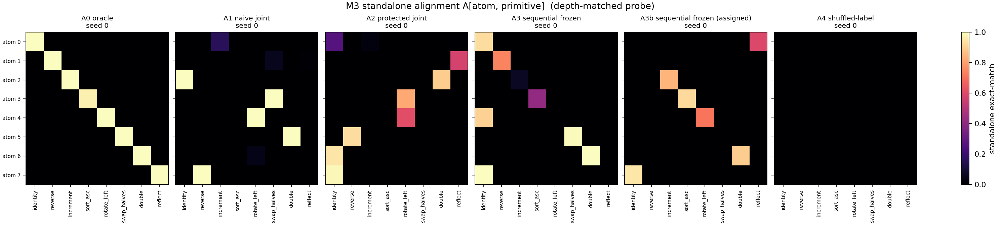
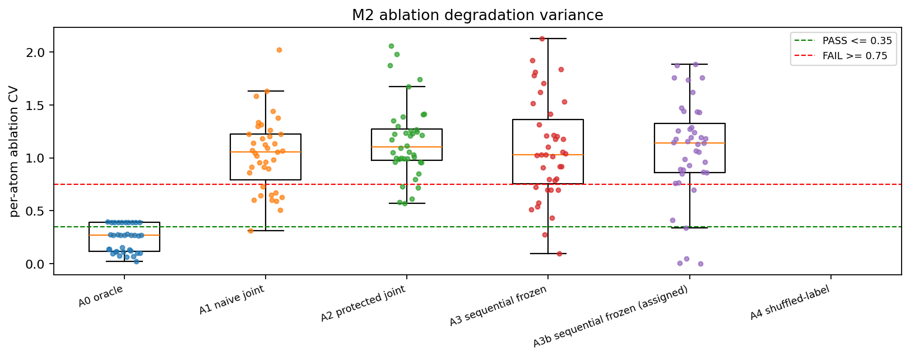
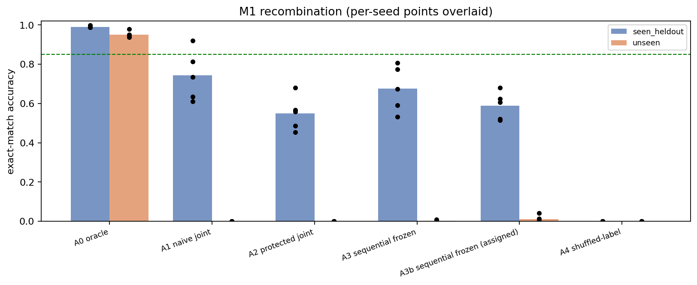

# E1 -- Atom Factorization Battery: results

Runs aggregated: 30 across 6 arms.

## Headline metrics (mean +/- std over seeds)

Pre-registered gate metrics (spec 8): `M1_acc_unseen`, `M1_gap`, `M2_cv`, `M3_align`, `M3_purity`, `M5_dead`. Everything else is diagnostic.

`M3_closed_map_error` is decoder-free and depth-free and **adjudicates when the M3 probes disagree** (DECISIONS.md D21): the pre-registered `M3_align` proved ~4.5x noisier across seeds and read above its PASS threshold on two A3 seeds whose atoms were inert. `M3_align` still decides the verdict as pre-registered; no threshold was moved.

| arm | n | M1_acc_seen | M1_acc_unseen | M1_gap | M2_cv | M2_dead | M2_cv_multitask_only | M3_align | M3_purity | M3_align_1step | M3_align_best_s | M3_closed_map_error | M3_closed_map_coverage | M3_closed_map_error_matched | M4_routing_acc_seen | M4_routing_acc_unseen | M5_entropy | M5_dead | M6_soft_hard_gap | M7_drift_step1 | M7_acc_teacher_forced | M7_recovery | acc_singleton | acc_ablate_all |
|---|---|---|---|---|---|---|---|---|---|---|---|---|---|---|---|---|---|---|---|---|---|---|---|---|
| A0 oracle | 5 | 0.991 ± 0.004 | 0.951 ± 0.016 | 0.040 ± 0.013 | 0.234 ± 0.008 | 1.000 ± 0.000 | 0.234 ± 0.008 | 0.996 ± 0.002 | 0.996 ± 0.002 | 0.997 ± 0.002 | 0.998 ± 0.001 | 0.030 ± 0.003 | 8.000 ± 0.000 | 0.030 ± 0.003 | 1.000 ± 0.000 | 1.000 ± 0.000 | 1.000 ± 0.000 | 1.000 ± 0.000 | 0.000 ± 0.000 | 0.032 ± 0.004 | 0.999 ± 0.000 | 0.048 ± 0.016 | 0.997 ± 0.001 | 0.063 ± 0.000 |
| A1 naive joint | 5 | 0.743 ± 0.128 | 0.000 ± 0.000 | 0.743 ± 0.128 | 1.036 ± 0.099 | 0.200 ± 0.447 | 1.036 ± 0.099 | 0.598 ± 0.112 | 0.598 ± 0.112 | 0.156 ± 0.034 | 0.939 ± 0.065 | 0.905 ± 0.057 | 1.000 ± 0.000 | 1.447 ± 0.038 | 0.532 ± 0.120 | 0.505 ± 0.170 | 0.968 ± 0.030 | 0.200 ± 0.447 | 0.000 ± 0.000 | 1.542 ± 0.029 | 0.097 ± 0.045 | 0.097 ± 0.045 | 0.857 ± 0.144 | 0.009 ± 0.020 |
| A2 protected joint | 5 | 0.549 ± 0.088 | 0.001 ± 0.000 | 0.549 ± 0.088 | 1.158 ± 0.107 | 0.000 ± 0.000 | 1.158 ± 0.107 | 0.653 ± 0.132 | 0.651 ± 0.130 | 0.103 ± 0.035 | 0.856 ± 0.073 | 0.879 ± 0.037 | 1.000 ± 0.000 | 1.436 ± 0.021 | 0.549 ± 0.059 | 0.448 ± 0.190 | 0.949 ± 0.017 | 0.000 ± 0.000 | -0.000 ± 0.000 | 1.551 ± 0.017 | 0.054 ± 0.009 | 0.054 ± 0.009 | 0.761 ± 0.048 | 0.000 ± 0.000 |
| A3 sequential frozen | 5 | 0.675 ± 0.117 | 0.003 ± 0.004 | 0.672 ± 0.114 | 1.089 ± 0.187 | 0.200 ± 0.447 | 1.089 ± 0.187 | 0.790 ± 0.134 | 0.790 ± 0.134 | 0.050 ± 0.059 | 0.944 ± 0.010 | 0.476 ± 0.025 | 1.000 ± 0.000 | 0.667 ± 0.028 | 0.711 ± 0.112 | 0.688 ± 0.095 | 0.968 ± 0.024 | 0.200 ± 0.447 | 0.000 ± 0.001 | 0.717 ± 0.035 | 0.021 ± 0.028 | 0.018 ± 0.030 | 0.898 ± 0.039 | 0.000 ± 0.000 |
| A3b sequential frozen (assigned) | 5 | 0.589 ± 0.070 | 0.012 ± 0.018 | 0.578 ± 0.071 | 1.079 ± 0.151 | 0.000 ± 0.000 | 1.108 ± 0.144 | 0.437 ± 0.303 | 0.437 ± 0.303 | 0.013 ± 0.021 | 0.907 ± 0.061 | 0.458 ± 0.041 | 1.000 ± 0.000 | 0.638 ± 0.065 | 0.469 ± 0.238 | 0.412 ± 0.264 | 0.957 ± 0.020 | 0.000 ± 0.000 | -0.002 ± 0.003 | 0.685 ± 0.083 | 0.017 ± 0.028 | 0.005 ± 0.034 | 0.820 ± 0.129 | 0.000 ± 0.000 |
| A4 shuffled-label | 5 | 0.000 ± 0.000 | 0.000 ± 0.000 | 0.000 ± 0.000 | n/a | 8.000 ± 0.000 | n/a | 0.000 ± 0.000 | 0.000 ± 0.000 | 0.000 ± 0.000 | 0.000 ± 0.000 | 0.346 ± 0.004 | 1.000 ± 0.000 | 1.224 ± 0.004 | 0.200 ± 0.000 | 0.000 ± 0.000 | 0.958 ± 0.043 | 8.000 ± 0.000 | 0.000 ± 0.000 | 1.359 ± 0.007 | 0.000 ± 0.000 | 0.000 ± 0.000 | 0.000 ± 0.000 | 0.000 ± 0.000 |

## Pre-registered threshold judgement (spec 8)

PASS requires all six. FAIL on any one is a fail.

**Read the A0 row with care.** A0 is the oracle: it is trained with ground-truth routing and intermediate-state supervision that no other arm receives, so its PASS is a *ceiling*, not evidence that atoms factorize under training (DECISIONS.md D4). A0 and the diagnostic arms (A4 leakage control, A3b) are excluded from the program verdict; only A1/A2/A3 decide it.

| arm | M1_acc_unseen | M1_gap | M2_cv | M3_align | M3_purity | M5_dead | verdict |
|---|---|---|---|---|---|---|---|
| A0 oracle | PASS | PASS | PASS | PASS | PASS | PASS | **PASS** |
| A1 naive joint | FAIL | FAIL | FAIL | AMBIGUOUS | PASS | PASS | **FAIL** |
| A2 protected joint | FAIL | FAIL | FAIL | AMBIGUOUS | PASS | PASS | **FAIL** |
| A3 sequential frozen | FAIL | FAIL | FAIL | AMBIGUOUS | PASS | PASS | **FAIL** |
| A3b sequential frozen (assigned) | FAIL | FAIL | FAIL | FAIL | AMBIGUOUS | PASS | **FAIL** |
| A4 shuffled-label | FAIL | PASS | AMBIGUOUS | FAIL | FAIL | FAIL | **FAIL** |

## Parameter accounting (H5)

Composer and library are separate line items; never combine them.

| arm | composer | atoms total | encoder | decoder | composer/atoms |
|---|---|---|---|---|---|
| A0 oracle | 29,376 | 2,103,552 | 51,136 | 50,762 | 0.0140 |
| A1 naive joint | 29,376 | 2,103,552 | 51,136 | 50,762 | 0.0140 |
| A2 protected joint | 29,376 | 2,103,552 | 51,136 | 50,762 | 0.0140 |
| A3 sequential frozen | 29,376 | 2,103,552 | 51,136 | 50,762 | 0.0140 |
| A3b sequential frozen (assigned) | 29,376 | 2,103,552 | 51,136 | 50,762 | 0.0140 |
| A4 shuffled-label | 29,376 | 2,103,552 | 51,136 | 50,762 | 0.0140 |

## Verdict

FAIL(training-signal) -- the architecture and the optimizer are both adequate: the oracle reaches a genuinely factorized, composing solution over the SAME architecture and optimizer (teacher-forced >=0.99, closed-map error <=0.10). Every unsupervised arm fails by never making its atoms closed maps (closed-map error >=0.30). What is missing is a training SIGNAL -- nothing in the task loss requires intermediate states to stay on the encoder manifold. This is NOT FAIL(representational): H6 cannot be refuted by arms that fail while an oracle over the same architecture succeeds. Next step is to add the missing signal (intermediate-state supervision, a cycle/reconstruction term, or an architectural constraint that keeps the state on-manifold), then re-run.

