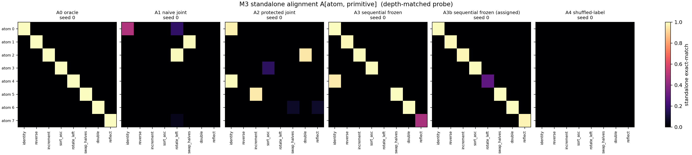
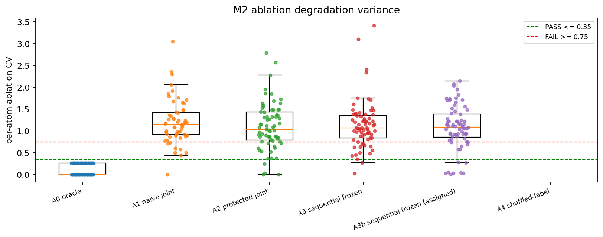
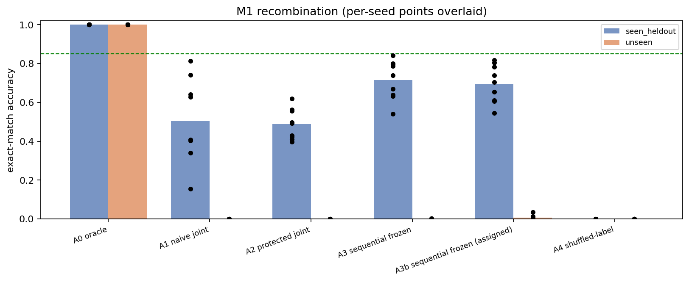

# E1 -- Atom Factorization Battery: results

Runs aggregated: 54 across 6 arms.

## Headline metrics (mean +/- std over seeds)

Pre-registered gate metrics (spec 8): `M1_acc_unseen`, `M1_gap`, `M2_cv`, `M3_align`, `M3_purity`, `M5_dead`. Everything else is diagnostic.

`M3_closed_map_error` is decoder-free and depth-free and **adjudicates when the M3 probes disagree** (DECISIONS.md D21): the pre-registered `M3_align` proved ~4.5x noisier across seeds and read above its PASS threshold on two A3 seeds whose atoms were inert. `M3_align` still decides the verdict as pre-registered; no threshold was moved.

| arm | n | M1_acc_seen | M1_acc_unseen | M1_gap | M2_cv | M2_dead | M2_cv_multitask_only | M3_align | M3_purity | M3_align_1step | M3_align_best_s | M3_closed_map_error | M3_closed_map_coverage | M3_closed_map_error_matched | M4_routing_acc_seen | M4_routing_acc_unseen | M5_entropy | M5_dead | M6_soft_hard_gap | M7_drift_step1 | M7_acc_teacher_forced | M7_recovery | acc_singleton | acc_ablate_all |
|---|---|---|---|---|---|---|---|---|---|---|---|---|---|---|---|---|---|---|---|---|---|---|---|---|
| A0 oracle | 9 | 1.000 ± 0.000 | 1.000 ± 0.000 | 0.000 ± 0.000 | 0.115 ± 0.000 | 1.000 ± 0.000 | 0.115 ± 0.000 | 1.000 ± 0.000 | 1.000 ± 0.000 | 1.000 ± 0.000 | 1.000 ± 0.000 | 0.004 ± 0.003 | 8.000 ± 0.000 | 0.004 ± 0.003 | 1.000 ± 0.000 | 1.000 ± 0.000 | 1.000 ± 0.000 | 1.000 ± 0.000 | 0.000 ± 0.000 | 0.004 ± 0.003 | 1.000 ± 0.000 | 0.000 ± 0.000 | 1.000 ± 0.000 | 0.062 ± 0.000 |
| A1 naive joint | 9 | 0.504 ± 0.213 | 0.000 ± 0.000 | 0.504 ± 0.213 | 1.247 ± 0.359 | 1.444 ± 1.424 | 1.260 ± 0.344 | 0.382 ± 0.194 | 0.374 ± 0.194 | 0.131 ± 0.093 | 0.750 ± 0.196 | 0.880 ± 0.184 | 1.000 ± 0.000 | 1.476 ± 0.111 | 0.437 ± 0.191 | 0.336 ± 0.237 | 0.886 ± 0.067 | 1.444 ± 1.424 | 0.000 ± 0.000 | 1.587 ± 0.059 | 0.061 ± 0.055 | 0.061 ± 0.055 | 0.702 ± 0.228 | 0.016 ± 0.022 |
| A2 protected joint | 9 | 0.488 ± 0.079 | 0.000 ± 0.000 | 0.488 ± 0.079 | 1.101 ± 0.126 | 0.111 ± 0.333 | 1.131 ± 0.098 | 0.666 ± 0.130 | 0.663 ± 0.132 | 0.055 ± 0.010 | 0.870 ± 0.085 | 0.958 ± 0.056 | 1.000 ± 0.000 | 1.497 ± 0.024 | 0.649 ± 0.083 | 0.572 ± 0.131 | 0.928 ± 0.027 | 0.111 ± 0.333 | 0.000 ± 0.000 | 1.583 ± 0.023 | 0.032 ± 0.009 | 0.032 ± 0.009 | 0.749 ± 0.141 | 0.000 ± 0.000 |
| A3 sequential frozen | 9 | 0.716 ± 0.100 | 0.001 ± 0.001 | 0.715 ± 0.100 | 1.138 ± 0.204 | 0.000 ± 0.000 | 1.138 ± 0.204 | 0.741 ± 0.225 | 0.740 ± 0.225 | 0.183 ± 0.217 | 0.968 ± 0.050 | 0.517 ± 0.060 | 1.000 ± 0.000 | 0.646 ± 0.079 | 0.700 ± 0.164 | 0.700 ± 0.200 | 0.976 ± 0.016 | 0.000 ± 0.000 | -0.000 ± 0.001 | 0.687 ± 0.089 | 0.145 ± 0.182 | 0.144 ± 0.181 | 0.902 ± 0.071 | 0.000 ± 0.000 |
| A3b sequential frozen (assigned) | 9 | 0.696 ± 0.097 | 0.007 ± 0.012 | 0.689 ± 0.090 | 1.081 ± 0.156 | 0.000 ± 0.000 | 1.081 ± 0.156 | 0.906 ± 0.073 | 0.905 ± 0.074 | 0.002 ± 0.001 | 0.984 ± 0.015 | 0.503 ± 0.021 | 1.000 ± 0.000 | 0.651 ± 0.037 | 0.749 ± 0.067 | 0.735 ± 0.097 | 0.977 ± 0.022 | 0.000 ± 0.000 | -0.000 ± 0.001 | 0.696 ± 0.044 | 0.001 ± 0.001 | -0.005 ± 0.012 | 0.908 ± 0.095 | 0.000 ± 0.000 |
| A4 shuffled-label | 9 | 0.000 ± 0.000 | 0.000 ± 0.000 | 0.000 ± 0.000 | n/a | 8.000 ± 0.000 | n/a | 0.000 ± 0.000 | 0.000 ± 0.000 | 0.000 ± 0.000 | 0.000 ± 0.000 | 0.337 ± 0.020 | 1.000 ± 0.000 | 1.225 ± 0.016 | 0.200 ± 0.000 | 0.000 ± 0.000 | 0.942 ± 0.064 | 8.000 ± 0.000 | 0.000 ± 0.000 | 1.362 ± 0.013 | 0.000 ± 0.000 | 0.000 ± 0.000 | 0.000 ± 0.000 | 0.000 ± 0.000 |

## Pre-registered threshold judgement (spec 8)

PASS requires all six. FAIL on any one is a fail.

**Read the A0 row with care.** A0 is the oracle: it is trained with ground-truth routing and intermediate-state supervision that no other arm receives, so its PASS is a *ceiling*, not evidence that atoms factorize under training (DECISIONS.md D4). A0 and the diagnostic arms (A4 leakage control, A3b) are excluded from the program verdict; only A1/A2/A3 decide it.

| arm | M1_acc_unseen | M1_gap | M2_cv | M3_align | M3_purity | M5_dead | verdict |
|---|---|---|---|---|---|---|---|
| A0 oracle | PASS | PASS | PASS | PASS | PASS | PASS | **PASS** |
| A1 naive joint | FAIL | FAIL | FAIL | FAIL | AMBIGUOUS | AMBIGUOUS | **FAIL** |
| A2 protected joint | FAIL | FAIL | FAIL | AMBIGUOUS | PASS | PASS | **FAIL** |
| A3 sequential frozen | FAIL | FAIL | FAIL | AMBIGUOUS | PASS | PASS | **FAIL** |
| A3b sequential frozen (assigned) | FAIL | FAIL | FAIL | PASS | PASS | PASS | **FAIL** |
| A4 shuffled-label | FAIL | PASS | AMBIGUOUS | FAIL | FAIL | FAIL | **FAIL** |

## Parameter accounting (H5)

Composer and library are separate line items; never combine them.

| arm | composer | atoms total | encoder | decoder | composer/atoms |
|---|---|---|---|---|---|
| A0 oracle | 29,376 | 2,103,552 | 51,136 | 50,762 | 0.0140 |
| A1 naive joint | 29,376 | 2,103,552 | 51,136 | 50,762 | 0.0140 |
| A2 protected joint | 29,376 | 2,103,552 | 51,136 | 50,762 | 0.0140 |
| A3 sequential frozen | 29,376 | 2,103,552 | 51,136 | 50,762 | 0.0140 |
| A3b sequential frozen (assigned) | 29,376 | 2,103,552 | 51,136 | 50,762 | 0.0140 |
| A4 shuffled-label | 29,376 | 2,103,552 | 51,136 | 50,762 | 0.0140 |

## Verdict

FAIL(training-signal) -- a factorized, composing solution is REACHABLE here: the oracle reaches one over the SAME architecture and optimizer (teacher-forced >=0.99, closed-map error <=0.10). Every unsupervised arm fails by never making its atoms closed maps (closed-map error >=0.30). The best-supported reading is that a training SIGNAL is missing -- nothing in the task loss requires intermediate states to stay on the encoder manifold. This is NOT FAIL(representational): H6 cannot be refuted by arms that fail while an oracle over the same architecture succeeds. NOTE: the oracle varies routing supervision, intermediate targets, state consistency, objective AND effective budget at once, so it establishes feasibility under privileged supervision, NOT that the optimizer and learned-routing architecture are adequate for DISCOVERY (E1_REPORT 6b). Next step is to supply the missing signal, then re-run.

