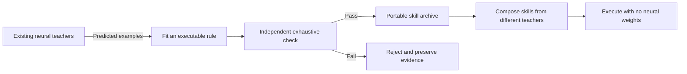

# Skill Forge

**A neural model can teach a skill, then become unnecessary for executing it.**

Skill Forge queries existing Atom models, infers compact executable programs from their predictions, checks those programs independently, and stores the verified ones in a shared library. Programs recovered from different training runs can then work together without loading any neural weights.

The ambitious research direction is to make learned knowledge accumulate as portable, checkable programs. Neural models would do the difficult work of learning and proposing; a growing program library would preserve reusable results. This prototype tests a constrained first step on the repository's six-digit world. It does not demonstrate a general replacement for neural models.



## Result

The prospectively specified experiment **passed every success gate** on the user's Ryzen 9 6900HX CPU. The main battery took approximately 65 seconds, reusing existing trained checkpoints. No new neural training was performed.

| Measurement | Observed result |
|---|---:|
| Real teacher checkpoints | 4 |
| Admitted teacher/operation entries | 24 |
| Distinct verified operations | 8 |
| Inputs exhaustively checked per candidate | 1,000,000 |
| Main runtime outputs | 18,048 / 18,048 correct |
| Longest tested sequence | 256 operations |
| Mixed-origin sequences | 544 of 564 |
| Neural weights loaded by deployment runtime | 0 |
| Payload for eight distinct operations | 528 bytes |
| Maximum simultaneously cached operator payload | 66 bytes |
| Actual runtime peak process memory | 39.27 MiB |

The sources complemented each other: A33 supplied P4, which no A14 source passed the admission gate for; A14 supplied the reversal operations missing from A33. A separately implemented audit recertified all eight binaries over the full domain and reproduced every saved runtime answer.

Read [RESULTS.md](RESULTS.md) for the evidence, failures, surprising rejected candidate, and interpretation. The raw machine-readable decision is [VERDICT.json](results/VERDICT.json).

## Reproduce and inspect

Run from the repository root in PowerShell using the existing environment:

```powershell
& .venv/Scripts/python.exe -m unittest AtomV3.test_forge -v
& .venv/Scripts/python.exe AtomV3/analysis/independent_audit.py
```

The main experiment command is:

```powershell
& .venv/Scripts/python.exe -u AtomV3/run_experiment.py
```

With the saved results present, this resumes completed work and rewrites the final summary; it does not query the teachers again. For an independent fresh run, use a separate copy of the repository with the required V2 checkpoints and an empty `AtomV3/results` directory. Preserve this run's evidence. Scripts record absolute binary paths, so a relocated copy should regenerate its result artifacts rather than reuse an old deployment plan. The audit checks saved evidence and writes a timestamped-content audit JSON at its fixed path.

The protocol, implementation, harness, split, and checkpoints were hashed before result-bearing queries. The original V1/V2 files were not changed.

| File | Purpose |
|---|---|
| [PROTOCOL.md](PROTOCOL.md) | Prospective hypothesis, query budgets, controls, and pass/fail rules |
| [RELATED_WORK.md](RELATED_WORK.md) | Close precedents and novelty limits |
| [compiler.py](compiler.py) | Fit source-position choices and digit tables from examples |
| [harvest.py](harvest.py) | Query frozen teachers and synthetic controls |
| [verify_archive.py](verify_archive.py) | Exhaustive verification, archive admission, and evaluation |
| [runtime.py](runtime.py) | Execute binary operators with a one-operator cache |
| [run_experiment.py](run_experiment.py) | Sequential execution and integrity checks |
| [test_forge.py](test_forge.py) | Thirteen synthetic implementation tests |
| [results/REGISTRATION.json](results/REGISTRATION.json) | Pre-run source and checkpoint hashes |
| [results/harvest](results/harvest) | Raw queries, predictions, fitted programs, and rejected candidates |
| [results/verified/archive.json](results/verified/archive.json) | Full candidate diagnostics and admitted archive |
| [analysis/independent_audit.json](analysis/independent_audit.json) | Post-result independent implementation audit |

## Interpretation

The supported claim is exact recovery and interoperability of skills from imperfect neural teachers **within a supplied finite grammar**. The grammar and common digit interface are explicit design inputs. The exact verifier already knows the task specification; in this world, simply executing that specification would also solve the task. This is an extraction experiment, not a practical claim that a compiler is needed to perform these known digit operations.

Program extraction and learned program libraries have substantial prior art. The interesting local result is that failed internal neural composition did not prevent successful external extraction, and that different teachers supplied complementary usable skills. Extending that result to unknown program structure and useful verification without full answer enumeration remains the central research problem.
